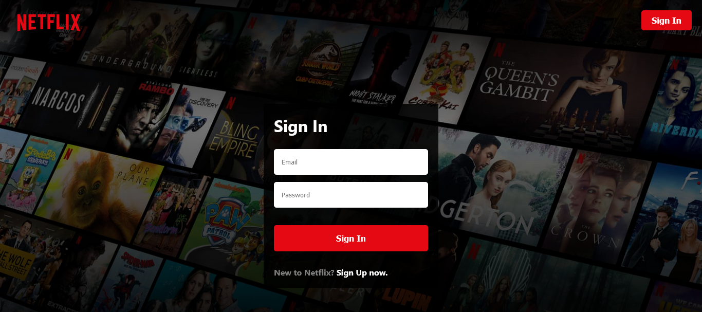
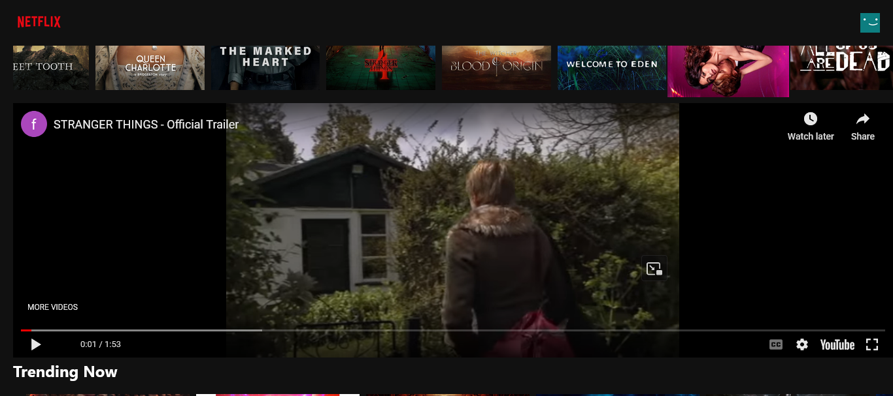
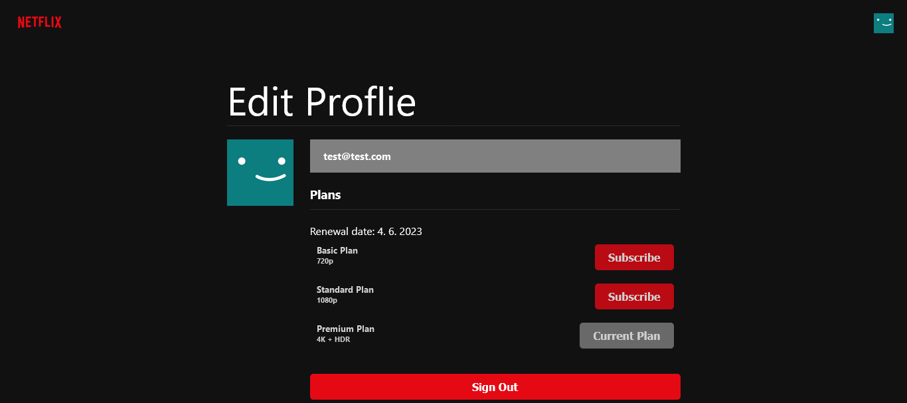
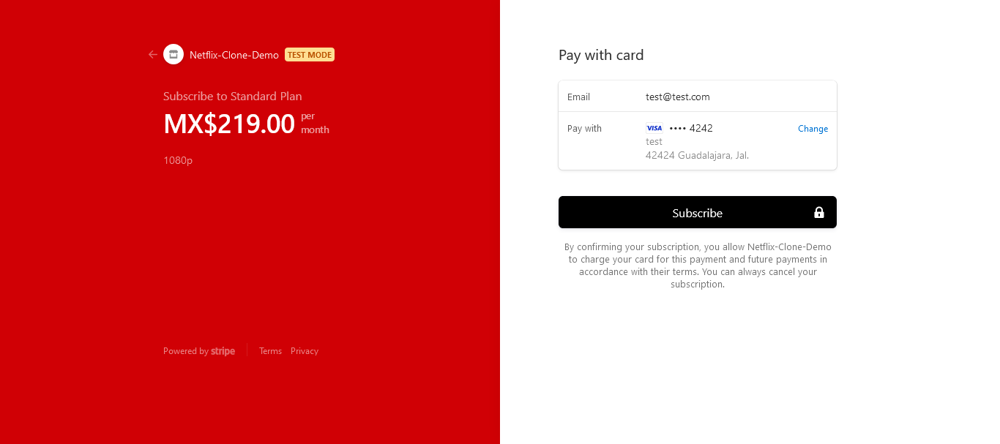

<h1>Netflix Clone :popcorn:</h1>

<h2>This project is a replica of Netflix, brought to life using cutting-edge technologies and tools, including React, Redux, Firebase, and Stripe.</h2>

Features

    Responsive Design: This Netflix clone is built with responsiveness in mind, ensuring an optimal viewing experience on various devices, from desktops to mobile phones.

    User Registration: Utilizing Firebase, users can create and manage their accounts, enabling a personalized streaming experience.

    State Management: Redux is employed to efficiently store and manage user data, enhancing the application's performance.

    Subscription Management: Stripe integration allows users to sign up for premium plans and process secure payments.

Technologies Used

    React: A powerful JavaScript library for building dynamic user interfaces, providing a smooth and responsive streaming experience.

    Redux: State management made simple, ensuring efficient data flow and seamless user interactions throughout the application.

    Firebase: A scalable backend platform that offers secure authentication, real-time database, and hosting services, enabling smooth user experiences.

    Stripe: Industry-leading payment processing technology, providing a secure and reliable payment gateway for subscription services.

### Link

- Live Site: [Netflix](https://netflix-clone-26c81.web.app/)

### Screenshots

---

# Getting Started with Create React App and Redux

This project was bootstrapped with [Create React App](https://github.com/facebook/create-react-app), using the [Redux](https://redux.js.org/) and [Redux Toolkit](https://redux-toolkit.js.org/) template.

## Available Scripts

In the project directory, you can run:

### `npm start`

Runs the app in the development mode.\
Open [http://localhost:3000](http://localhost:3000) to view it in your browser.

The page will reload when you make changes.\
You may also see any lint errors in the console.

### `npm test`

Launches the test runner in the interactive watch mode.\
See the section about [running tests](https://facebook.github.io/create-react-app/docs/running-tests) for more information.

### `npm run build`

Builds the app for production to the `build` folder.\
It correctly bundles React in production mode and optimizes the build for the best performance.

The build is minified and the filenames include the hashes.\
Your app is ready to be deployed!

See the section about [deployment](https://facebook.github.io/create-react-app/docs/deployment) for more information.

### `npm run eject`

**Note: this is a one-way operation. Once you `eject`, you can't go back!**

If you aren't satisfied with the build tool and configuration choices, you can `eject` at any time. This command will remove the single build dependency from your project.

Instead, it will copy all the configuration files and the transitive dependencies (webpack, Babel, ESLint, etc) right into your project so you have full control over them. All of the commands except `eject` will still work, but they will point to the copied scripts so you can tweak them. At this point you're on your own.

You don't have to ever use `eject`. The curated feature set is suitable for small and middle deployments, and you shouldn't feel obligated to use this feature. However we understand that this tool wouldn't be useful if you couldn't customize it when you are ready for it.

## Learn More

You can learn more in the [Create React App documentation](https://facebook.github.io/create-react-app/docs/getting-started).

To learn React, check out the [React documentation](https://reactjs.org/).
